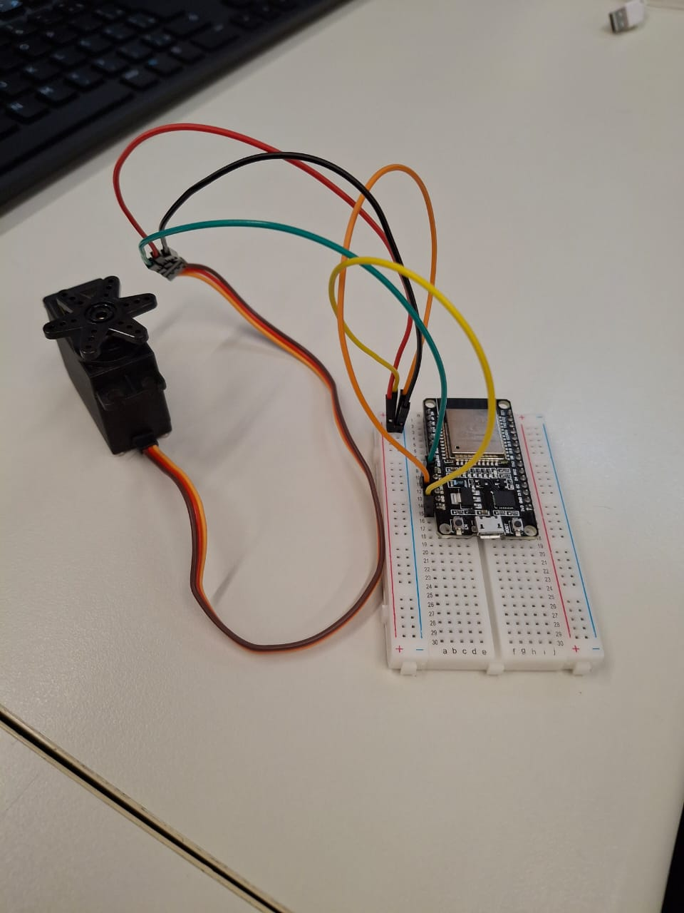
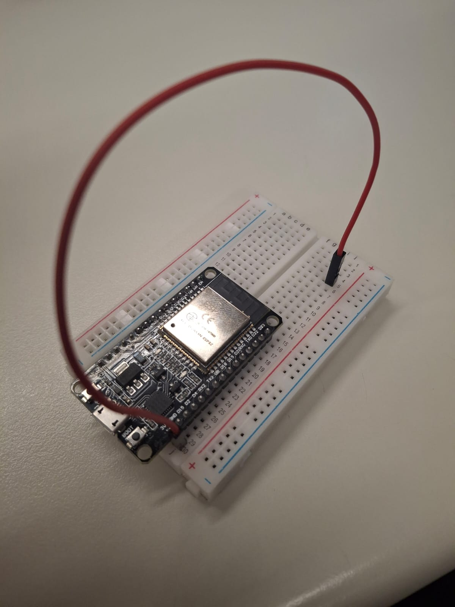
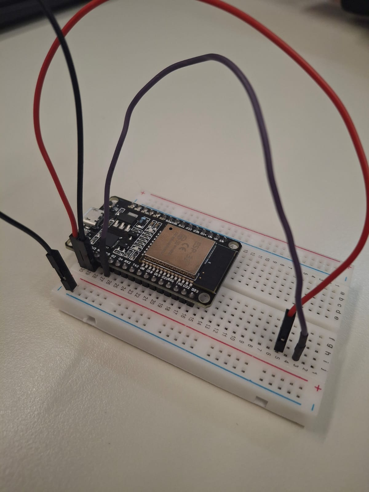
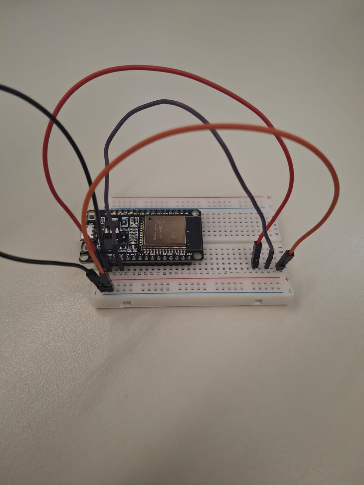
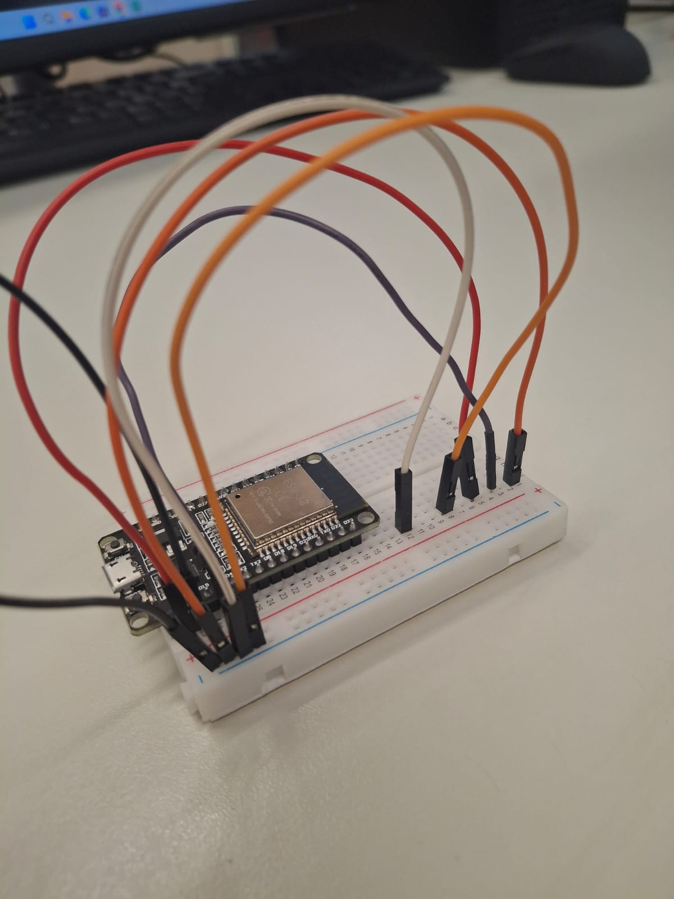
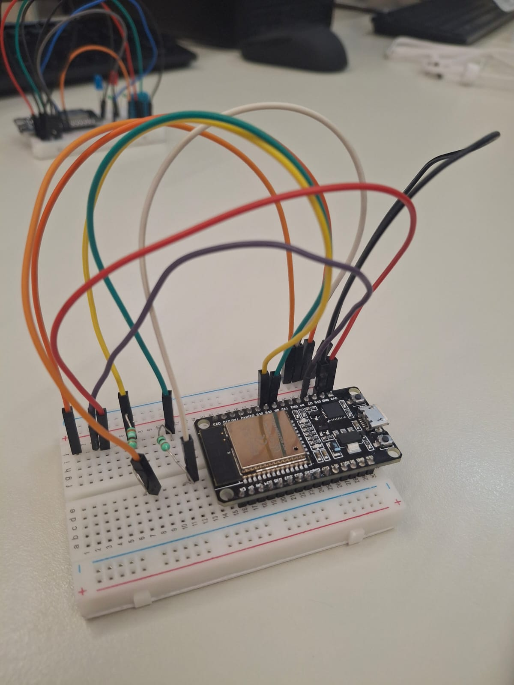

# Projetos_IoT

## Tutorial Montagem Servo/Motor | ESP-32 - Passo a Passo

### 1️⃣ Passo 1  

### 2️⃣ Passo 2  

### 3️⃣ Passo 3  

### 4️⃣ Passo 4  

### 5️⃣ Passo 5  

### 6️⃣ Passo 6  

### 7️⃣ Passo 7  

### 8️⃣ Passo 8  

### 🏁 Passo 9 — Resultado Final   

---

# Tutorial Montagem DHT/Temperatura | ESP-32 - Passo a Passo

### 1️⃣ Passo 1  

### 2️⃣ Passo 2  

### 3️⃣ Passo 3  

### 4️⃣ Passo 4  

### 5️⃣ Passo 5  

### 6️⃣ Passo 6  

### 7️⃣ Passo 7  

### 8️⃣ Passo 8  

### 9️⃣ Passo 9 

### 🔟  Passo 10  

### 🏁 Passo 11 — Resultado Final 

